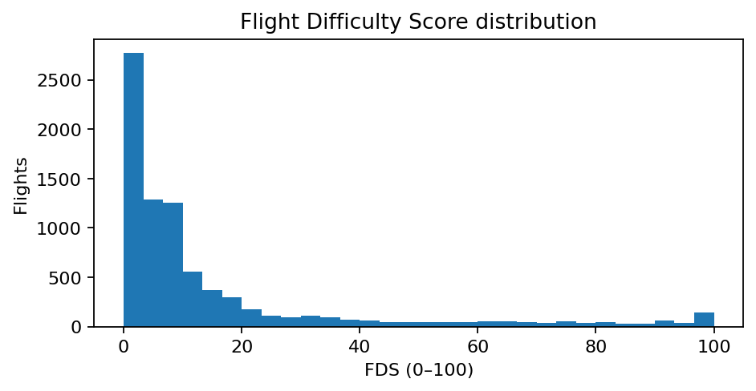
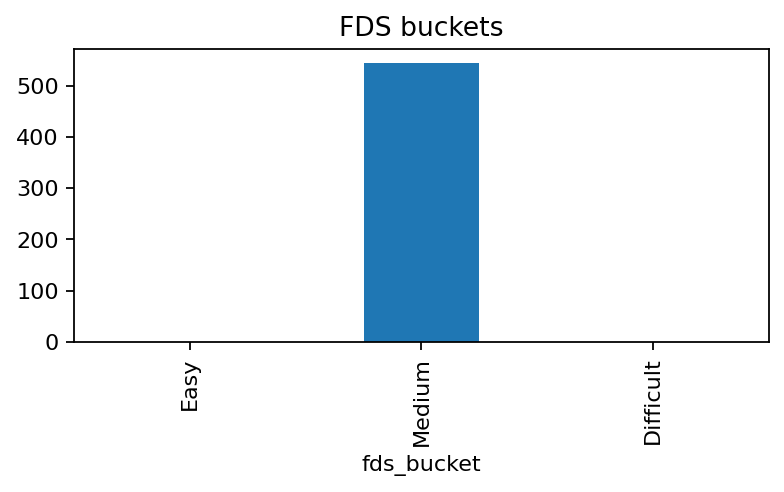
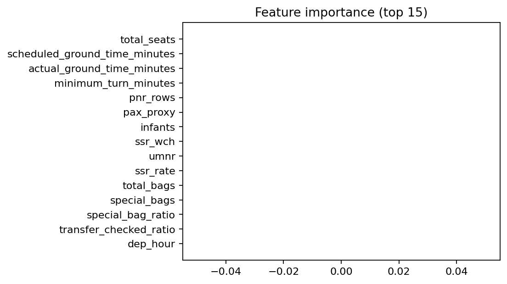
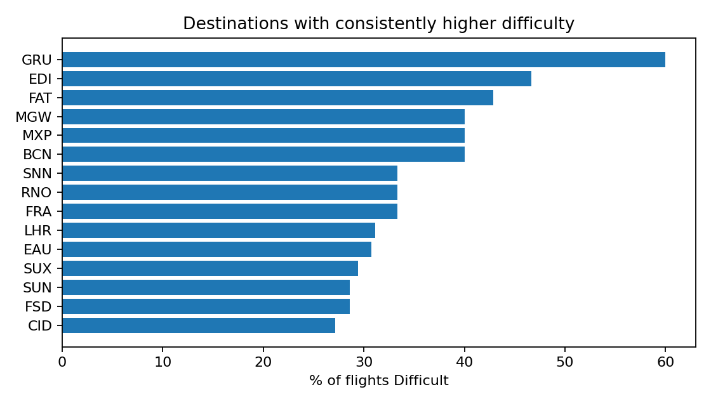
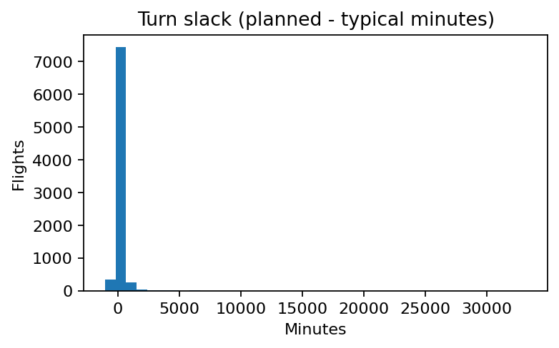
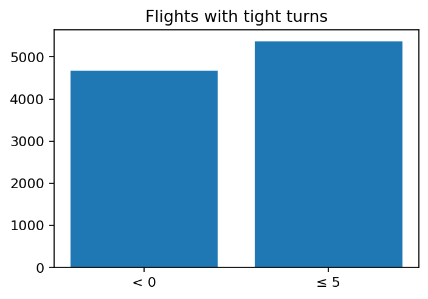
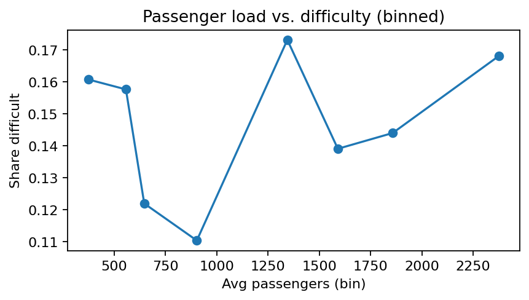
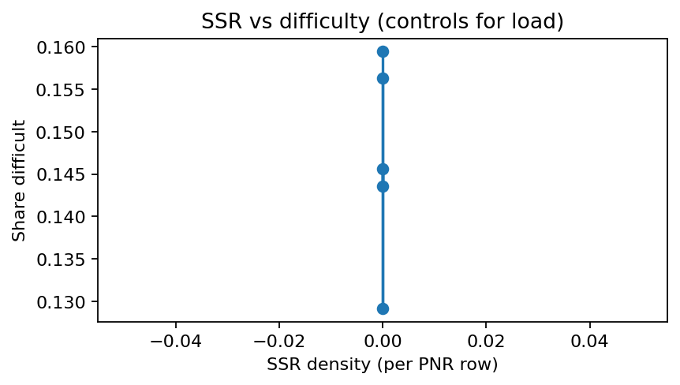
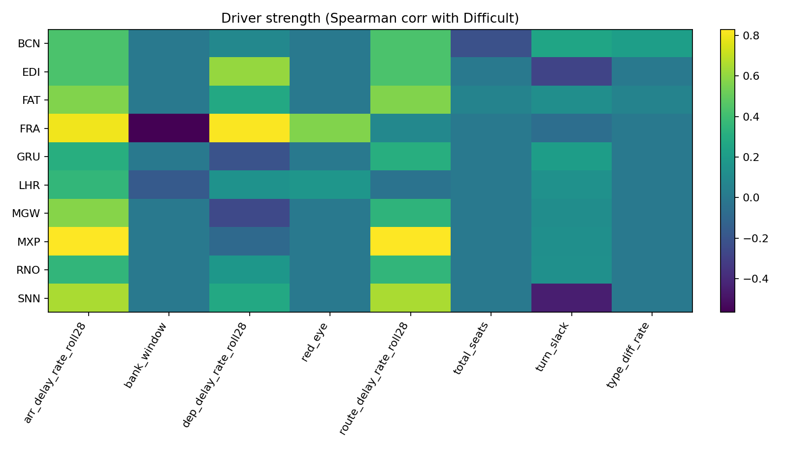

# SkyHack 3.0 – United Airlines  
**Flight Difficulty Scoring, EDA & Operational Insights**

This repo builds a daily **Flight Difficulty Score (FDS)** for every flight, ranks flights **within each day**, classifies them into **Easy / Medium / Difficult**, performs the EDA requested in the brief, and generates **post-analysis operational insights** (destinations that are consistently harder, likely drivers, and concrete actions).

> **Tip:** If any image in this README shows as broken, just run:
> ```powershell
> python .\scripts\run_eda.py
> python .\scripts\run_all.py
> python -m scripts.charts
> python -m scripts.post_ops_insights   # optional but recommended
> ```
> Images are written to `artifacts/figures/`.

---

## 🔎 Results at a glance

<table>
  <tr>
    <td></td>
    <td></td>
  </tr>
  <tr>
    <td align="center"><em>Flight Difficulty Score distribution</em></td>
    <td align="center"><em>Daily classification: Easy / Medium / Difficult</em></td>
  </tr>
</table>

<table>
  <tr>
    <td></td>
    <td></td>
  </tr>
  <tr>
    <td align="center"><em>What matters most (model feature importance)</em></td>
    <td align="center"><em>Destinations with consistently higher difficulty</em></td>
  </tr>
</table>

---

## 📊 Visual Gallery (auto-generated)

### 1) Flight Difficulty Score (FDS)
- 
- 

### 2) Feature Importance
- 

### 3) Turn Performance
- 
- 

### 4) Bags & Load
- 
- 
- 

### 5) Post-Analysis & Operational Insights
- 
- 

> Want these on one slide? Copy the PNGs above from `artifacts/figures/` into your deck.  
> The file `artifacts/outputs/ops_recos.md` contains ready-to-read action bullets mapped to drivers.

---

## 🧭 Repository Layout

```
.
├── data/                                  # your 5 provided CSVs
│   ├── Airports Data.csv
│   ├── Bag+Level+Data.csv
│   ├── Flight Level Data.csv
│   ├── PNR Remark Level Data.csv
│   └── PNR+Flight+Level+Data.csv
├── src/
│   ├── config.py                           # paths, constants
│   ├── load.py                             # robust CSV loader (load_all)
│   ├── features.py                         # key normalization + feature engineering
│   ├── labeler.py                          # difficulty label (used for training/EDA)
│   ├── train.py                            # (baseline) model training
│   ├── score.py                            # scoring & bucketing
│   ├── utils.py                            # time helpers, small utils
│   └── __init__.py
├── scripts/
│   ├── run_eda.py                          # builds dataset, labels, writes EDA CSVs
│   ├── run_all.py                          # trains & scores → flight_scores.csv
│   ├── charts.py                           # saves charts to artifacts/figures
│   ├── make_rank_tables.py                 # writes daily_rankings*.csv (optional)
│   └── post_ops_insights.py                # Deliverable #3 outputs (insights)
├── artifacts/
│   ├── outputs/                            # all CSV/MD outputs live here
│   └── figures/                            # PNG charts saved here
└── requirements.txt
```

---

## 🚀 How to Run (Windows PowerShell)

```powershell
python -m venv .venv
.\.venv\Scripts\Activate.ps1
pip install -r .\requirements.txt

# 1) EDA + features
python .\scripts\run_eda.py

# 2) Train + score
python .\scripts\run_all.py

# 3) Charts for slides
python -m scripts.charts

# 4) (Optional) Daily ranking tables
python -m scripts.make_rank_tables

# 5) (Optional) Insights (destinations & drivers)
python -m scripts.post_ops_insights
```

**macOS/Linux** – replace activation with `source .venv/bin/activate`, and keep the `python -m scripts.*` forms.

---

## 🧪 What gets produced

**EDA CSVs** → `artifacts/outputs/`
- `eda_delay_summary.csv` • `eda_turn_slack_counts.csv` • `eda_bag_ratio.csv` •
  `eda_pax_corr.csv` • `eda_ssr_vs_delay_by_load.csv`

**Model & Scoring** → `artifacts/outputs/`
- `flight_scores.csv` (includes `fds` & `fds_bucket`) • `feature_importance.csv`

**Daily ranking tables (optional)** → `artifacts/outputs/`
- `daily_rankings.csv` • `daily_rankings_top10.csv` • `daily_bucket_counts.csv`

**Operational Insights** → `artifacts/outputs/`
- `destination_consistency.csv` • `destination_drivers.csv` • `ops_recos.md`

**All charts** → `artifacts/figures/` (embedded above)

---

## 🧩 Notes & Troubleshooting
- If you see `ModuleNotFoundError: src`, run scripts as modules (`python -m scripts.charts`) or add `__init__.py` to `scripts/`.
- If some charts are missing, re-run the chart/insight scripts.
- On Windows, if you see `ORD→DEN` in CSVs, change the arrow to ASCII (`"->"`) in `src/features.py`.

---

## 📜 License / Notes
This starter is for hackathon use. Data is provided by the organizer and used only for this challenge.
